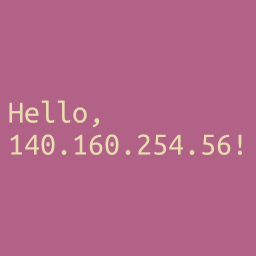

# Avatar

A small Rust application for serving images containing the client's IP address.

This code is inspired by earlier work done by [Andrew Kvalheim]. That work and
this code are discussed in a [blog post] I wrote.

## Licensing

The [Ubuntu Mono] font used in this software is licensed under the terms of the
[Ubuntu Font License].

[Andrew Kvalheim]: https://andrew.kvalhe.im
[blog post]: https://tuckersiemens.com/posts/avatar-png
[Ubuntu Mono]: https://design.ubuntu.com/font
[Ubuntu Font License]: https://launchpad.net/ubuntu-font-licence
